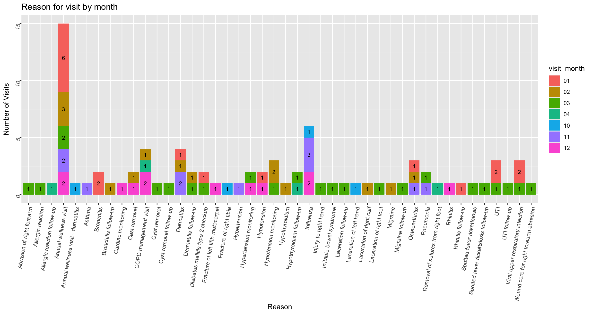
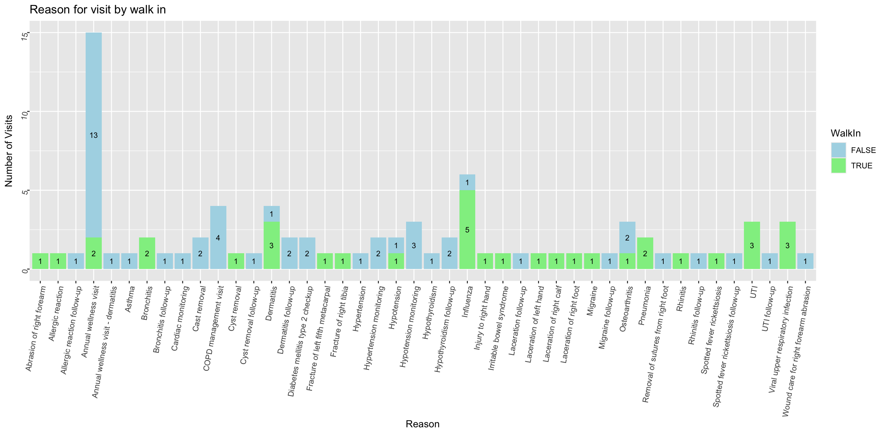
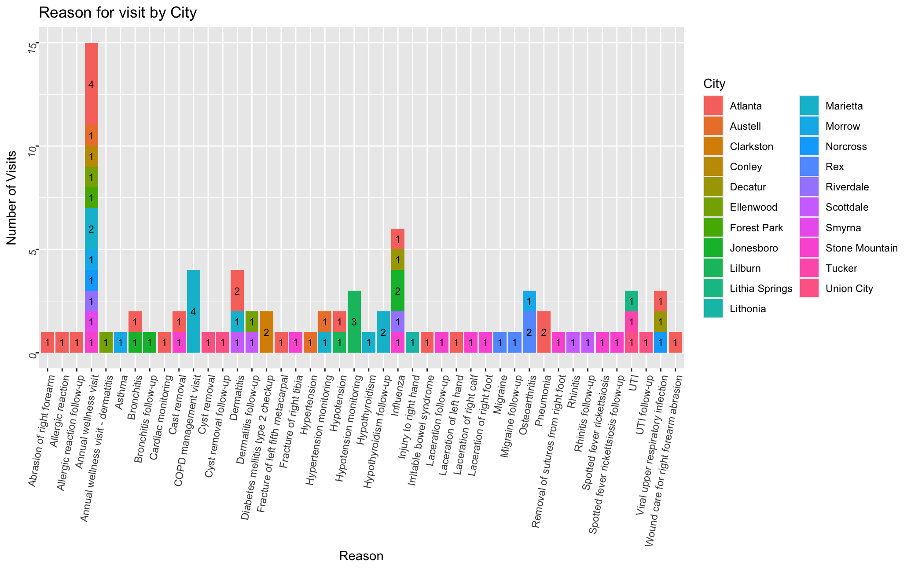
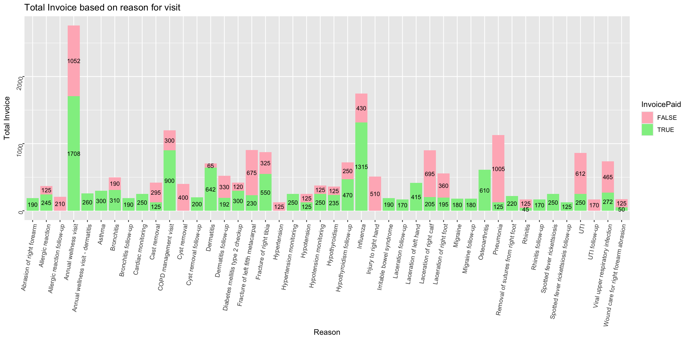
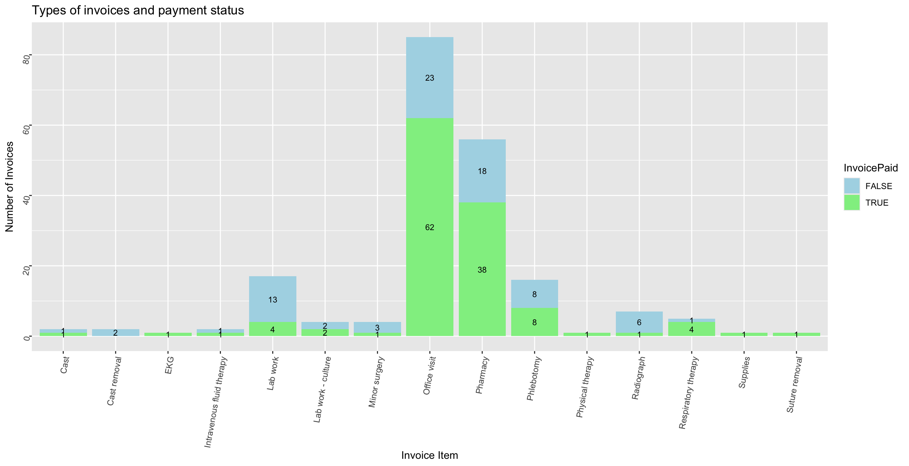

# Analysis of Patient Billing
<p> by: Sasha Botsul </p>

#### This page analyzes the patient, visit, and billing data with 5 charts.

## Summary of Process
<p>The data first needed to be read and joined, which was done using a left join.</p>

```
df_billing <- read_excel("Billing.xlsx")
df_patient <- read_excel("Patient.xlsx")
df_visit <- read_excel("Visit.xlsx")

df_join1 <- left_join(df_billing, df_visit, by= c('VisitID'))
df_join2 <- left_join(df_join1, df_patient, by = c('PatientID'))
```
<p>In order to get unique data for the graphs showing reasons for visit, the data needed to be distinct.</p>

```
unique_visit <- df_join2 %>%
  distinct(PatientID, VisitDate, .keep_all = TRUE)
```
## 1. Reasons for Visit By Month

<p>This bar chart depicts the reasons for a patient visit, segmented by month.</p>
<p>-Based on the chart, it seems that the third month, March, had a lot of variety in reasons for visit.</p>
<p>-Patients got their annual wellness visits done either within the first 3 months or the last two months of the year. Majority of patients got their annuals visits done in January.</p>

## 2. Reasons for Visit based on Walk In or Not

<p>This bar chart depicts the reasons for a patient visit, segmenting by whether or not they were a walk in.</p>
<p>-Majority of the visits were not walk ins, especially for annual wellness visits.</p>
<p>-A lot of the walk in reasons likely involved patients looking for a diagnosis of their potential cold. Ex: Bronchitis, Influenza, Pneumonia.</p>

## 3. Reasons for Visit based on City

<p>This bar chart depicts the reasons for a patient visit, segmented by city.</p>
<p>-Many patients came from Atlanta, GA.</p>
<p>-The annual wellness visits and influenza visits had the most variety in city.</p>

## 4. Total Invoice based on Reason for Visit

<p>This bar chart depicts the total invoices for each of the visit reasons, segmented by whether or not it was paid.</p>
<p>-The annual wellness visit has the highest total invoice, with over half the amount paid.</p>

## 5. Invoice Types and Payment Status

<p>This bar chart depicts the types of invoices, segmented by whether or not they were paid. </p>
<p>-Majority of the invoices are office visits and pharmacy.</p>
<p>-About 75% of the lab work invoices have not been paid.</p>


