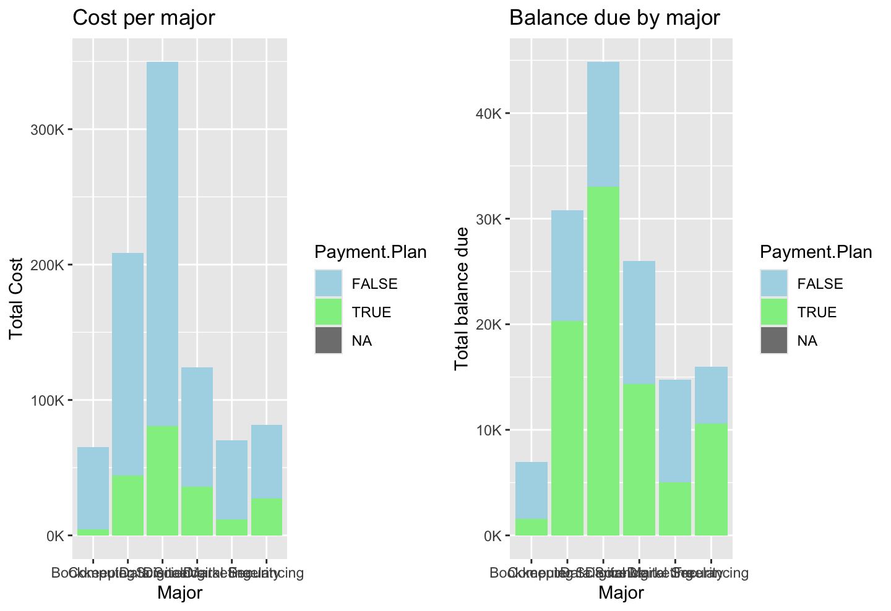

# Analysis of student data

## Number of Student per Major

  

## Students per Birth Year

 Put some words in here and display a picture 

## Majors by Generation

 Put some words in here and display a picture 

## Total Cost per Major

## Balance Due by Major

## Comparing Total Cost and Balance Due by Major

