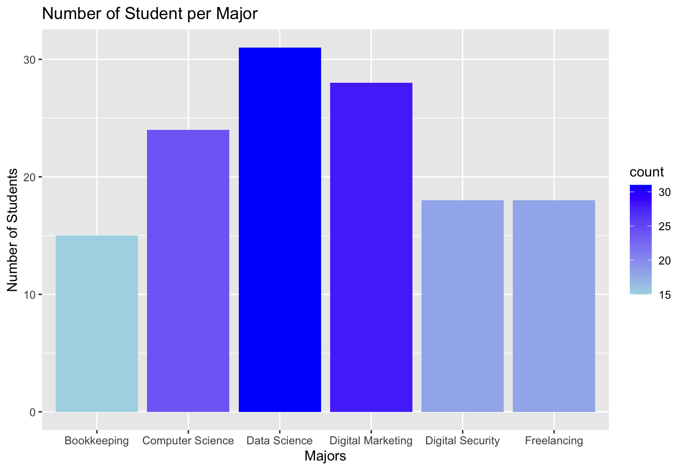

# Analysis of Student Data

 by: Sasha Botsul 

#### This page analyzes the student data in several different ways using majors, birth years, total cost, and balance due.

## Number of Student per Major

 -This bar chart depicts the number of students per major in a gradient fill. 

-The majors with less students are a lighter blue, and those with more students are a darker shade of blue.

-The major with the most students, with 31, is Data Science. The major with the least students, with 15, is Bookkeeping.

## Students per Birth Year

 -This bar chart depicts the number of students per birth year. 

 -The birth year with the most students, 7, is 2001. 

 -This data will serve a larger purpose in the next graph, showing majors by generation. 

## Majors by Generation

 -This stacked bar chart depicts the generational concentration within each major. 

 -For example, Millennials make up about 39% of the students in Data Science. 

 -Overall, Generation Z has the smallest population in this group of students. 

## Total Cost per Major

 -This stacked bar chart displays the total costs per major, segmenting by whether or not the student has a payment plan. 

 -Data Science has the greatest cost, which also accounts for it having the most students. 

 -Bookkeeping, based on the visual, has the smallest concentration of students with payment plans. 

## Balance Due by Major

 -This bar chart displays the total balances due per major, segmenting by whether or not the student has a payment plan. 

 -Once again, Data Science is on top with the highest balance due. 

 -A lot of the students that have a remaining balance have a payment plan. 

## Comparing Total Cost and Balance Due by Major

 -This image shows a comparison of the total costs by major and balances due by major, both segmented by payment plans. 

 -Between the two graphs, the most notable shift is the concentration of students with payment plans. 

 -It is fair to interpret that the majority of students with remaining balances have a payment plan. 

