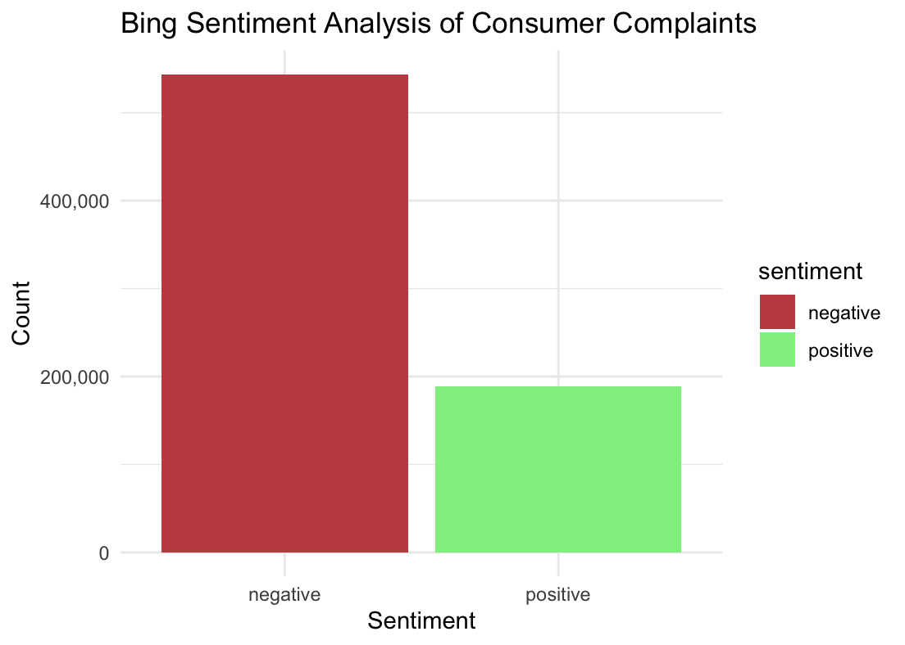
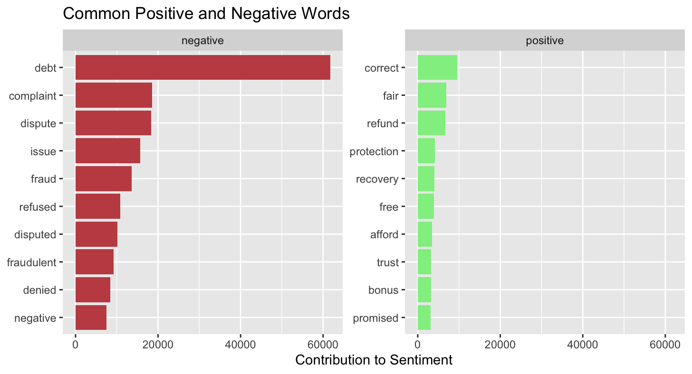
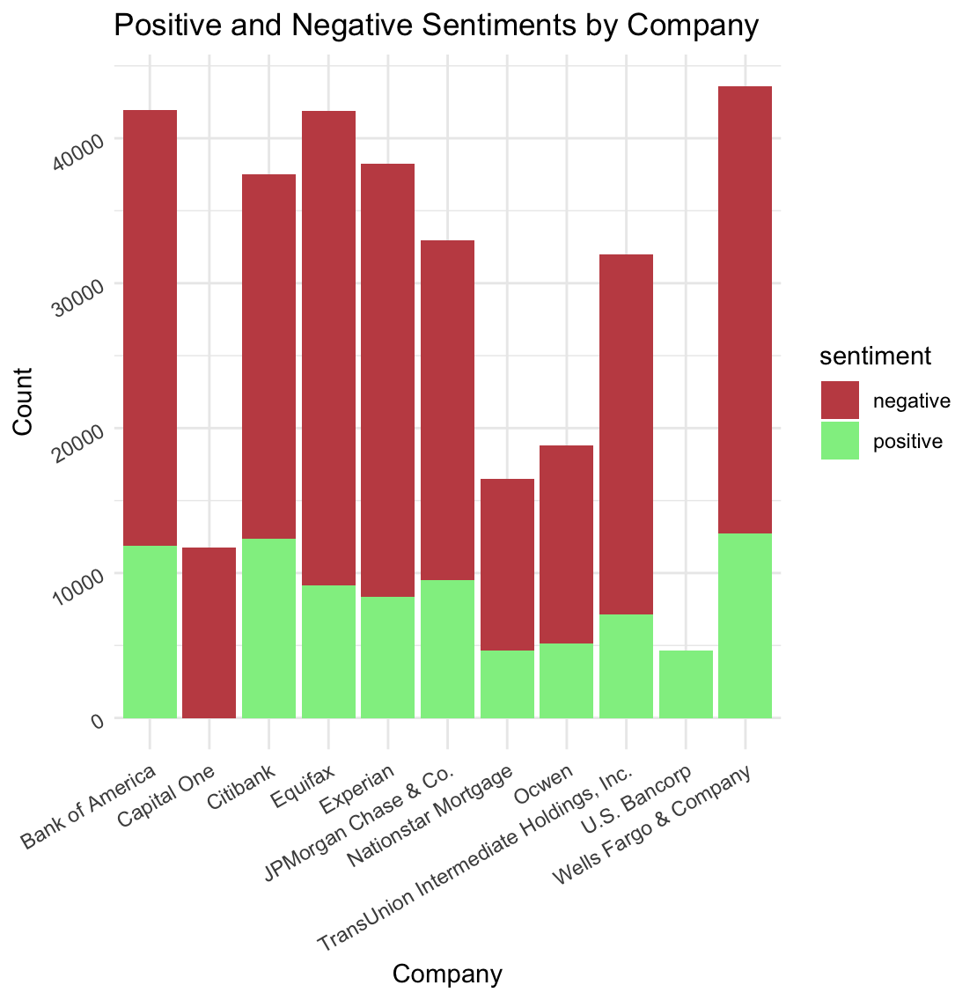
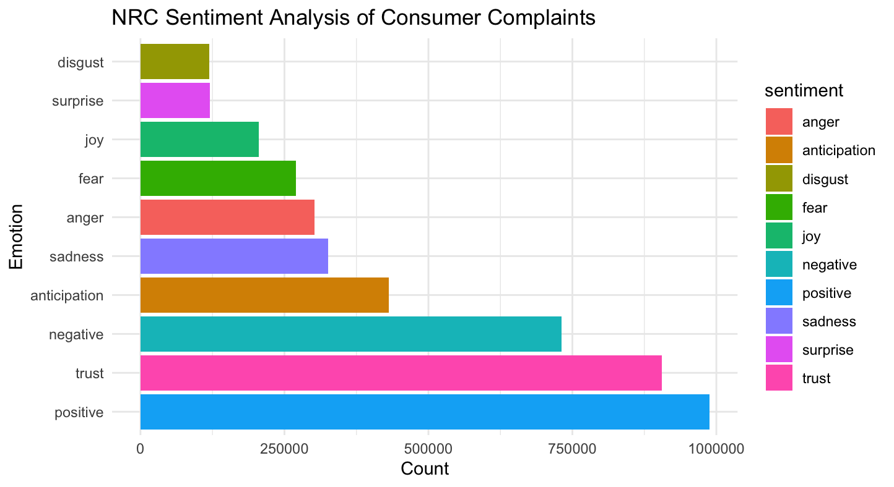
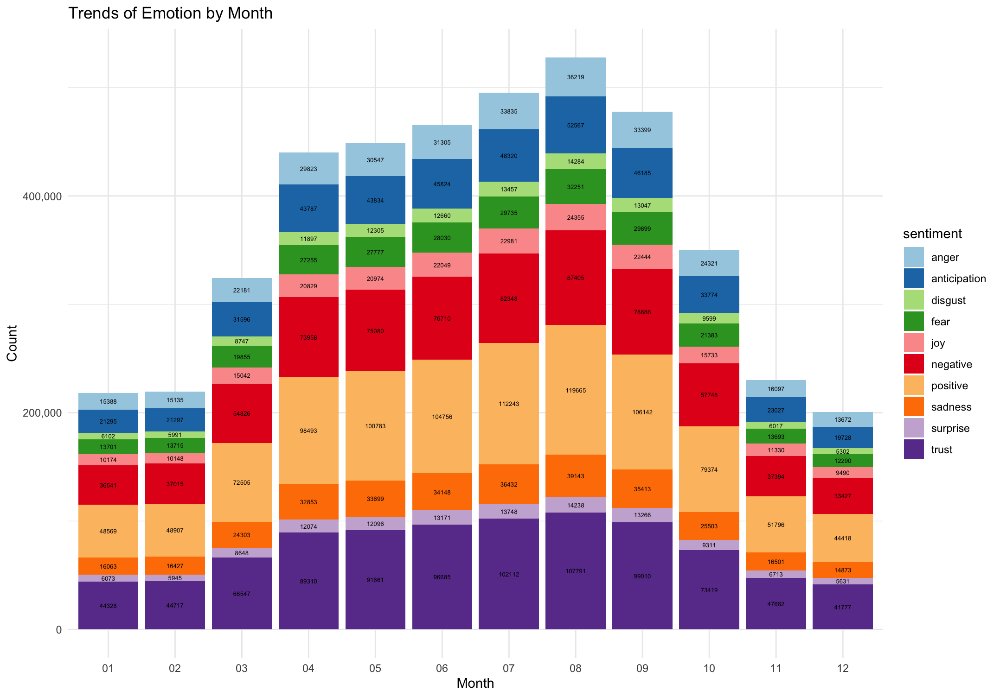

# Text Analysis of Consumer Complaints
<p> by: Sasha Botsul </p>

#### This page analyzes the consumer complaint narratives/messages to the companies using sentiment analyses, bing and NRC.

---
## Data Cleaning
1. Date Format
- Convert the Date Received and Date sent to Company to a proper format
```
df_complaints$Date.received <- mdy(df_complaints$Date.received)
df_complaints$Date.sent.to.company <- mdy(df_complaints$Date.sent.to.company)
```
2. Text Columns
- Convert N/A values into "Unknown"
```
text_columns <- c("Product", "Sub.product", "Issue", "Sub.issue", "Company", "State", "Tags",
                  "Consumer.consent.provided.", "Submitted.via", "Company.response.to.consumer",
                  "Timely.response.", "Consumer.disputed.")
df_complaints[text_columns] <- lapply(df_complaints[text_columns], function(x) ifelse(is.na(x), "Unknown", x))
```
3. Categorical Columns
- Convert N/A values into "Unknown"
```
categorical_cols <- c("Consumer.complaint.narrative", "Company.public.response") 
df_complaints[categorical_cols] <- lapply(df_complaints[categorical_cols], function(x) ifelse(is.na(x), "Unknown", x))
df_complaints$Consumer.consent.provided.[df_complaints$Consumer.consent.provided. %in% c(NA, "N/A")] <- "Unknown"
```
4. Remove Zipcode Column
- Removed the Zipcode column due to inconsistency in data and unnecessary data.
```
df_complaints <- subset(df_complaints, select= -c(10))
```
5. Ensure Structure
- Remove any potential duplicates
- Check structure and summarize data
```
df_complaints<- distinct(df_complaints)
str(df_complaints)
summary(df_complaints)
```
6. Export Clean File
```
write.csv(df_complaints,'/Users/sashabotsul/Downloads/rstudio/text_analysis/clean_data.csv',  row.names= FALSE)
```
#### Cleaning Complaint Narrative
- Although the file itself is clean, the text needed to be cleaned before using for sentiment analysis.
- The text is broken up into individual tokens, removing stop words as well.
```
df_clean <- df_complaints %>%
  select(Consumer.complaint.narrative) %>%
  filter(Consumer.complaint.narrative != 'Unknown')%>%
  rename(text = 'Consumer.complaint.narrative')

df_token <- df_clean %>%
  unnest_tokens(word, text)%>%
  anti_join(stop_words, by = 'word')
```
---
## Text Analysis Using BING

1. Sentiment Analysis


- This bar chart shows the proportion of negative and positive sentiments.
- Considering the data is consumer complaints, the results are not shocking.
- The negative sentiment count is 543,382. The positive sentiment count is 188,536.
- This chart is valuable as it shows the overall sentiments of consumers among banks.

2. Common Positive and Negative Words


- This chart shows the 10 most common positive and negative words and their contribution to sentiment.
- 'Debt' is by far the most common word, being used 61,703 times.
- Looking at the positive words, it is likely that in context, they are not positive.
- This chart is valuable because it shows what the complaints are when looking at the top 10 negative words. An analyst can deduct that many complaints are related to consumers debt, fraud issues, potentially denied requests, etc.

3. Positive and Negative Sentiments by Company
- First, the data needed to be adjusted to include the companies.
```
df_clean3 <- df_complaints %>%
  select(Consumer.complaint.narrative, Company) %>%
  filter(Consumer.complaint.narrative != 'Unknown')%>%
  rename(text = 'Consumer.complaint.narrative')

df_token3 <- df_clean3 %>%
  unnest_tokens(word, text)%>%
  anti_join(stop_words, by = 'word')
```


- This chart shows the top 10 companies by positive and top 10 companies by negative sentiment.
- The company with the most negative sentiments is Equifax.
- What is surprising is that most of the banks are top 10 for both positive and negative, except for Capital One and U.S. Bancorp.
- This chart is valuable because is shows what companies are experiencing the most negative sentiments, which likely reflects how many people are sending in complaints.

## Text Analysis Using NRC

1. Sentiment Analysis


- This chart shows the proportions of emotions in consumer complaints.
- Very surprisingly, the graph shows that there were more positive sentiments than other emotions.
- Although disgust is the lowest, which should be relieving, it is still a high count of 119,408.
- This chart is valuable because it helps clarify the majority of emotions. If anger was the highest, companies should be concerned.

2. Emotions by Month
- First, the data needed to be adjusted to include the date.
```
df_clean2 <- df_complaints %>%
  select(Consumer.complaint.narrative, Date.sent.to.company) %>%
  filter(Consumer.complaint.narrative != 'Unknown')%>%
  rename(text = 'Consumer.complaint.narrative')

df_token2 <- df_clean2 %>%
  unnest_tokens(word, text)%>%
  anti_join(stop_words, by = 'word')
```


- This chart shows the proportion of emotions in consumer complaints by months.
- It seems that the data increases significantly during the middle of the year, likely reflecting the number of complaints.
- That is also when we see the negative sentiments increase.
- Overall, the proportions of emotions stay relatively stable; as the whole count increases, the proportions stay similar.
- This chart is valuable because it helps understand how sentiments change throughout the year, and if there is a significant outlier in one of the months.

---
## Conclusion
- There seems to be a significant among of complaints relating to debt.
- Despite majority negative sentiments, based in bing analysis, there is nothing concerning when viewing the nrc sentiment analysis.
